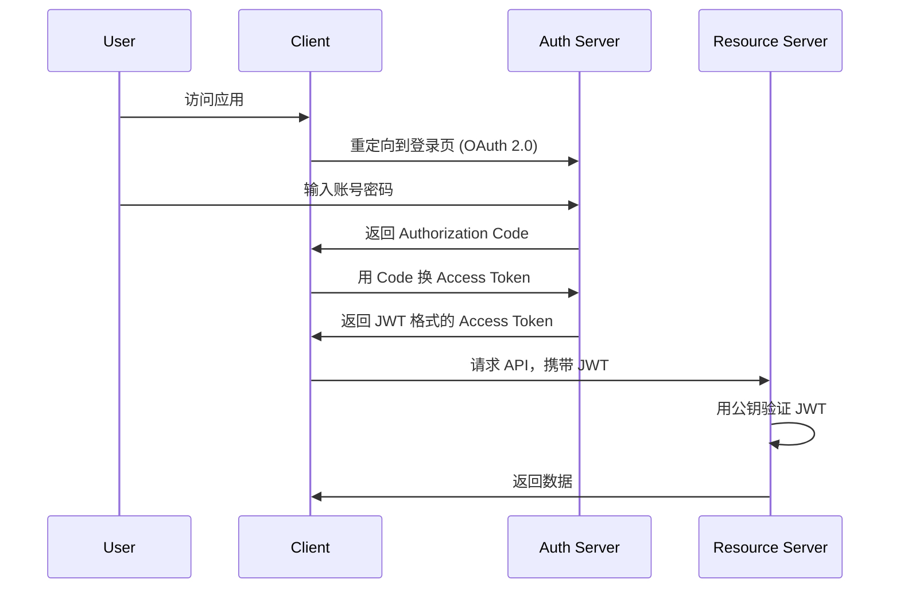

## 用户登录：用户登录需要加密吗，不需要，借助于https就可以防止网络截流

## 前端不能存储加密密钥，需要后台返回，之后前端本地存储

✅ **答案是：极有可能被获取 —— 本质上，这和把密码明文存在前端差不多危险。**

## 🔍 核心问题拆解

### 场景回顾（你描述的流程）：

1. 用户登录
2. 后端生成一个“加密密钥”（如 AES key）
3. 通过 HTTPS 返回给前端
4. 前端将该密钥保存在 `localStorage` / `uni.setStorage` 等本地存储中
5. 后续用它加密敏感数据（如用户笔记、表单等）

### 表面看很合理，但致命缺陷：

> **一旦密钥存在前端可持久化存储中，它就不再“秘密”了。** 

## 🕵️ 谁能获取这个密钥？

|                             |                           |                                                              |
| --------------------------- | ------------------------- | ------------------------------------------------------------ |
| **用户自己**                | ✅ 能                      | 打开 DevTools → Application → LocalStorage，直接看到         |
| **XSS 攻击者**              | ✅ 能                      | 注入恶意 JS →`localStorage.getItem('aesKey')`→ 发送到攻击者服务器 |
| **恶意浏览器扩展**          | ✅ 能                      | 可读取所有站点的 localStorage                                |
| **移动端：反编译/调试 App** | ✅ 能（UniApp 尤其风险高） | 通过 Frida、Xposed 或直接 hook`uni.setStorage`回调           |
| **物理接触设备者**          | ✅ 能                      | 连接手机导出 App 数据库（Android 可 root 查看）              |

> 🚨 **结论：任何存储在前端持久化介质中的密钥，都不应被视为“保密信息”。** 

## ❓那为什么有些应用还这么做？

确实有些应用会“看似”这么干，但通常有以下**缓解措施**：

|                                |            |                                             |
| ------------------------------ | ---------- | ------------------------------------------- |
| 用登录态 token 作为密钥        | ❌ 不安全   | token 本身可被窃取，且服务器知道            |
| 密钥分片 + 用户交互恢复        | ⚠️ 部分安全 | 如部分密码管理器用“知识问题”辅助恢复        |
| **密钥仅存内存，不持久化**     | ✅ 安全     | 页面关闭即丢，但牺牲 UX（不能后台自动同步） |
| **用用户主密码派生，不存密钥** | ✅ 安全     | 真正的 E2EE，如 Bitwarden、Standard Notes   |

## ✅ 安全地使用“后端下发密钥”的唯一合理场景

### 场景：**短期会话密钥（用于请求字段加密）**

- 后端在登录成功后返回一个 **5~10 分钟有效的临时密钥**
- 前端**只存在内存变量中**（如 Vue 的 data、全局变量），**绝不存 localStorage**
- 用于加密后续几个敏感请求（如修改手机号、支付确认）
- 密钥过期后，重新认证（如输短信验证码）获取新密钥

> 这样即使被 XSS 窃取，攻击窗口也很短，且无法持久利用。 

## 🛡️ 如果你坚持要用“后端返回密钥 + 前端存储”，如何降低风险？

虽然**不推荐**，但如果业务强需求（比如离线加密数据），可采取以下缓解：

|                                        |                                                              |
| -------------------------------------- | ------------------------------------------------------------ |
| **绝不存 localStorage/sessionStorage** | 改用内存变量（但刷新丢失）                                   |
| **加密密钥本身再用用户 PIN 保护**      | 弹窗让用户输 4 位 PIN → 用 PIN 派生密钥解密主密钥（类似手机银行） |
| **绑定设备指纹**                       | 后端下发密钥时绑定设备 ID，换设备需重新授权                  |
| **密钥定期轮换**                       | 每次登录生成新密钥，旧数据需迁移                             |
| **敏感操作需二次认证**                 | 即使有密钥，关键操作仍需短信/人脸验证                        |

> 但请注意：**这些只是“纵深防御”，不能根除风险**。 

## 🎯 终极建议（结合你做 UniApp 平板应用）

|                                      |                                                              |
| ------------------------------------ | ------------------------------------------------------------ |
| **普通业务（如表单提交、用户资料）** | 不要前端加密！用 HTTPS + 后端鉴权即可                        |
| **需要本地加密缓存（如草稿）**       | 用用户设置的**4位 PIN 或手势密码**派生密钥（仅内存持有）     |
| **高安全需求（如医疗、金融数据）**   | 实现**用户主密码派生密钥**（E2EE），接受“不能自动登录”的 UX 损失 |
| **多设备同步加密数据**               | 用非对称加密（如 RSA）：前端生成密钥对，私钥用主密码加密后上传 |

## 💡 一句话总结

> **“后端返回的密钥一旦存到前端本地存储，就等于公开了。”**
> 真正的安全，必须依赖 **用户记忆的秘密（主密码/PIN）**，而非服务器下发的任何值。 

如果你愿意分享具体场景（比如：你要加密什么数据？是否需要离线访问？用户是否愿意输密码？），我可以帮你设计一个**兼顾安全与体验**的方案。


## 那使用aes做数据加密时，是加密哪些数据，http的请求参数和返回结果相关全都要加密吗

这是一个非常实际且关键的问题。答案是：

> **通常不需要对 HTTP 请求参数和返回结果“全部加密”**。  
> **AES 加密应精准用于“真正敏感的数据字段”，而非整个 HTTP 通信**。

下面从**安全原则、适用场景、实操建议**三个层面详细说明。

---

## ✅ 核心原则：HTTPS 是基础，AES 是补充

| 层级             | 作用                                        | 是否必需             |
| ---------------- | ------------------------------------------- | -------------------- |
| **HTTPS (TLS)**  | 加密**整个 HTTP 流量**（URL、Header、Body） | ✅ **必须启用**       |
| **AES 字段加密** | 对**特定敏感字段**二次加密                  | ⚠️ **仅在必要时使用** |

> 🔐 **只要用了 HTTPS，网络传输本身已经是安全的**。AES 加密的目的不是防“网络截获”，而是解决其他问题。

---

## 🔍 那么，AES 到底该加密哪些数据？

### ✅ 推荐加密的场景（字段级加密）

| 敏感数据类型                         | 为什么需要 AES 二次加密？                                |
| ------------------------------------ | -------------------------------------------------------- |
| **身份证号、银行卡号、手机号**       | 满足 GDPR、等保、金融合规要求，防止日志/数据库泄露明文   |
| **用户私密内容**（如日记、聊天草稿） | 即使服务器被拖库，也无法读取明文（前提是密钥不存服务器） |
| **前端本地缓存的敏感数据**           | 避免 `localStorage`/`uni.setStorage` 中存明文            |
| **防内部人员查看**                   | 运维/开发无法通过数据库直接看到用户隐私                  |

> 📌 加密粒度：**只加密字段值，不是整个请求/响应**  
> 例如：
>
> ```json
> {
> "name": "张三",
> "id_card": "U2FsdGVkX1+ABC123...",  // ← 仅此字段加密
> "email": "zhangsan@example.com"
> }
> ```

---

### ❌ 不需要加密的场景

| 数据类型                               | 原因                                                         |
| -------------------------------------- | ------------------------------------------------------------ |
| **普通业务参数**（如商品ID、分页参数） | 无敏感性，加密徒增复杂度                                     |
| **整个 HTTP Body**                     | HTTPS 已加密，重复加密浪费 CPU                               |
| **Token、Session ID**                  | 它们本身就是临时凭证，泄露靠“有效期”和“绑定”控制，不是靠加密 |
| **公开信息**（如文章标题、商品名称）   | 无需保密                                                     |

---

## 🛠️ 实际开发中的典型做法

### 场景 1：提交用户身份证（前端 → 后端）

```js
// 前端（UniApp / Web）
const encryptedIdCard = aesEncrypt(idCardInput, TEMP_KEY); // TEMP_KEY 来自登录返回（仅内存）
await api.submitProfile({ name, id_card: encryptedIdCard });
```

```json
// 请求体（HTTPS 传输）
{
  "name": "张三",
  "id_card": "U2FsdGVkX1+KJHg7aBc..."
}
```

→ 后端收到后，**用相同密钥解密**，再存入数据库（或直接存密文，不解密）。

> ✅ 优势：即使数据库泄露，`id_card` 字段仍是密文。

---

### 场景 2：后端返回用户银行卡号

```json
// 后端响应（HTTPS）
{
  "user_id": 123,
  "bank_card": "U2FsdGVkX1+XyZ9qLmN..."  // ← 加密后的卡号
}
```

→ 前端用内存中的密钥解密后显示。

> ⚠️ 注意：**密钥不能硬编码**！应为临时会话密钥或用户主密码派生。

---

### 场景 3：完全不需要加密

```json
// 请求：获取商品列表
GET /api/products?page=1&category=books

// 响应
{
  "products": [
    { "id": 1001, "title": "《安全开发指南》", "price": 59.9 }
  ]
}
```

→ **无任何敏感字段，HTTPS 足够，无需 AES**。

---

## ⚠️ 重要安全提醒

1. **不要用 AES 替代 HTTPS**  
   即使你加密了所有字段，如果走 HTTP，攻击者仍可：
   - 重放请求
   - 篡改未加密字段（如 `price`）
   - 分析流量模式

2. **密钥管理决定安全性**  
   - 如果密钥是后端下发的 → 服务器能解密 → **不是端到端加密**
   - 如果用于合规（如防日志泄露），可接受
   - 如果声称“只有用户能看”，则必须用**用户主密码派生密钥**

3. **避免过度加密**  
   加密/解密消耗 CPU，影响性能，尤其在移动端（如你的 UniApp 平板应用）

---

## ✅ 最佳实践建议（结合你的技术栈）

| 你的需求                           | 建议                                                         |
| ---------------------------------- | ------------------------------------------------------------ |
| **普通 App（如企业内部工具）**     | 用 HTTPS + 后端权限控制，**不加密字段**                      |
| **需满足数据合规（如金融、医疗）** | 对身份证、银行卡等字段做 AES 加密，密钥由后端管理（短期会话密钥） |
| **高隐私产品（如笔记、密码管理）** | 用用户主密码派生密钥，实现 E2EE，**不依赖后端发密钥**        |
| **前端本地缓存敏感数据**           | 用用户 PIN 派生密钥，仅内存持有，退出清除                    |

---

## 💡 一句话总结

> **“用 HTTPS 保护通道，用 AES 保护内容”** ——  
> **通道安全是底线，内容加密是按需增强**。

如果你告诉我具体要加密什么数据（比如是用户身份证？支付信息？聊天记录？），我可以给你更精确的字段级加密方案。


## ❌ 常见误区纠正

|                    |                                                          |
| ------------------ | -------------------------------------------------------- |
| “前端加密更安全”   | HTTPS 已足够，前端加密是重复造轮子                       |
| “大厂都前端加密”   | 主流产品（支付宝、微信、Google）登录/绑卡均走 HTTPS 明文 |
| “防止抓包看到密码” | 抓包工具（Charles）需用户安装证书，属于授权调试，非攻击  |


## 可以理解为oauth是安全的传输通道，jwt是安全密码，rabc是业务层面的权限控制封装吗

你的类比**方向是对的，但用词稍有偏差**。我们可以稍作调整，让它更准确又不失直观：

---

### ✅ 更精准的比喻（保留你的思路，但修正技术细节）：

> **OAuth 2.0 是“安全授权的流程协议”**（不是通道）  
> **JWT 是“自包含的身份凭证”**（不是密码）  
> **RBAC 是“业务权限的决策模型”**（确实是封装）

---

### 🧩 逐个解释为什么这样更准确：

#### 1. **OAuth 2.0 ≠ 传输通道**

- 它**不负责加密通信**（那是 HTTPS/TLS 的事）；
- 它是**一套标准化的授权流程**，定义了：
  - 用户如何授权第三方；
  - 应用如何安全换取令牌；
  - 令牌如何用于访问资源。
- ✅ 所以它更像是 **“一套安全授权的规则和步骤”**，比如银行的“授权委托书办理流程”。

> 🔐 类比：OAuth 2.0 像是 **“公证处的授权委托流程”** —— 你怎么证明你有权替别人办事？它规定了步骤，但不提供保险箱。

---

#### 2. **JWT ≠ 密码**

- **密码是秘密（secret）**，需要保密；
- **JWT 是公开可读的凭证（credential）**，只是**不可伪造**（因为有签名）。
- JWT 里可以包含用户身份、角色等信息，**谁都能读，但只有签发方能生成合法签名**。
- ✅ 所以它是 **“带防伪印章的身份证”**，不是“保险柜密码”。

> 🪪 类比：JWT 像是 **一张带二维码和防伪水印的电子工作证** —— 门卫（服务端）扫码就能看到你的部门和权限，但无法伪造。

---

#### 3. **RBAC = 业务权限的封装 ✅（这个很准确！）**

- 它把“谁可以做什么”抽象成 **用户 → 角色 → 权限** 的关系；
- 业务代码只需问：“这个用户有 ‘admin’ 角色吗？” 而不用硬编码逻辑；
- ✅ 这就是典型的**策略封装**，便于维护和扩展。

> 🏢 类比：RBAC 像是 **公司门禁系统里的权限表** —— “经理”可以进财务室，“员工”只能进办公区。

---

### 🌟 综合比喻（更贴近现实）：

> 想象你要进入一个高科技园区：
>
> 1. **OAuth 2.0**：是你在门口 **通过人脸识别 + 手机验证码** 的 **入园授权流程**（证明你有权进入）；  
> 2. **JWT**：是入园后保安给你的 **临时电子通行证**（上面写着你的姓名、部门、有效期，带数字签名防伪）；  
> 3. **RBAC**：是园区内部的 **门禁规则** —— “研发部人员可进 A 区，财务部可进 B 区”。

---

### 🔍 技术本质再强调：

| 概念      | 本质                                      | 类比修正       |
| --------- | ----------------------------------------- | -------------- |
| OAuth 2.0 | **授权协议（Authorization Framework）**   | 授权流程规则 ✅ |
| JWT       | **令牌格式（Signed Token with Claims）**  | 防伪身份凭证 ✅ |
| RBAC      | **权限模型（Role-Based Access Control）** | 业务权限策略 ✅ |

---

### 💡 为什么这个区分很重要？

- 如果你认为 JWT 是“密码”，可能会把它当密钥用（比如用 JWT 加密数据）→ **大错！**；
- 如果你认为 OAuth 2.0 是“通道”，可能会忽略 HTTPS → **令牌可能被窃听**；
- 如果你把 RBAC 当成“可有可无的封装”，可能会写出满屏的 `if (user.id === 'admin')` → **难以维护**。

---

### ✅ 总结（一句话记住）：

> **OAuth 2.0 规定“怎么授权”，JWT 携带“你是谁+能干什么”，RBAC 决定“这件事你能不能干”。**

三者分工明确，协同工作，才是现代安全架构的基石。

如果你正在设计系统权限，我很乐意帮你画一张 **OAuth + JWT + RBAC 的集成架构图**，或者提供 **Next.js 中的 RBAC 中间件代码模板**。需要吗？😊


## oauth和jwt的优势是什么


OAuth 2.0 和 JWT（JSON Web Token）是现代身份认证与授权体系中的两个核心概念，它们**解决的问题不同，但常常配合使用**。理解它们各自的**优势和适用场景**，对设计安全、可扩展的系统至关重要。

---

## 🔑 一、先明确：它们不是“竞争对手”，而是“分工协作”

| 技术          | 定位                                    | 核心目标                                                     |
| ------------- | --------------------------------------- | ------------------------------------------------------------ |
| **OAuth 2.0** | **授权框架（Authorization Framework）** | 安全地让第三方应用**代表用户访问资源**（如“用微信登录”、“允许 App 读取你的 Google 日历”） |
| **JWT**       | **令牌格式（Token Format）**            | 一种**紧凑、自包含、可验证**的数据结构，常用于传递身份或授权信息 |

> ✅ **OAuth 2.0 可以使用 JWT 作为其令牌的载体**（例如：Access Token 是一个 JWT）。

---

## 🌟 二、OAuth 2.0 的核心优势

### 1. **标准化授权流程**

- 提供清晰的角色定义：**Resource Owner（用户）**、**Client（应用）**、**Authorization Server（授权服务器）**、**Resource Server（资源服务器）**。
- 支持多种 **Grant Types**（授权模式）：
  - Authorization Code（Web 应用推荐）
  - PKCE（移动端/SPA 安全增强）
  - Client Credentials（服务间通信）
  - Refresh Token（续期）

### 2. **最小权限原则（Least Privilege）**

- 用户可授权 **特定 scope**（如 `read:profile`、`write:email`），而非全权访问。
- 应用只能拿到它被允许的权限。

### 3. **解耦认证与业务**

- 业务系统（Resource Server）**无需处理密码**，只验证 Token；
- 认证逻辑集中在 Authorization Server（如 Auth0、Keycloak、自研 IDP）。

### 4. **支持三方登录（Federated Identity）**

- 用户可用 Google、GitHub、微信等账号登录你的应用；
- 你无需管理用户密码，降低安全风险和运维成本。

### 5. **支持 Token 吊销与生命周期管理**

- Refresh Token 可被撤销；
- Access Token 短期有效，降低泄露风险。

> ✅ **适用场景**：需要“委托授权”、“三方登录”、“细粒度权限控制”的系统。

---

## 🌟 三、JWT 的核心优势

### 1. **自包含（Self-contained）**

- Token 本身包含用户信息（如 `sub`, `email`, `roles`），**无需查数据库**即可知道“谁在请求”。
- 适合无状态服务（如微服务、Serverless）。

### 2. **无状态验证（Stateless Verification）**

- 任何服务只要持有公钥（RS256）或共享密钥（HS256），就能验证 Token 真伪；
- **无需调用中心服务器**，性能高、扩展性好。

### 3. **标准化 & 跨语言支持**

- RFC 7519 标准，几乎所有语言都有成熟库（如 `jsonwebtoken`、`PyJWT`、`jjwt`）；
- 与 HTTP Header（`Authorization: Bearer <token>`）天然集成。

### 4. **支持加密与签名**

- **JWS（签名）**：保证 Token 未被篡改（最常用）；
- **JWE（加密）**：保证 Token 内容不被窥探（高安全场景）。

### 5. **适合内部服务间信任**

- 在微服务架构中，服务 A 可签发 JWT 给服务 B，B 快速验证后处理业务。

> ✅ **适用场景**：需要无状态认证、内部服务通信、SSO（同域）、快速验证用户身份。

---

## 🤝 四、OAuth 2.0 + JWT 的经典组合



> ✅ **OAuth 2.0 负责“如何安全地获取 Token”**  
> ✅ **JWT 负责“Token 长什么样、如何验证”**

---

## ⚖️ 五、对比总结

| 特性                          | OAuth 2.0                                      | JWT                            |
| ----------------------------- | ---------------------------------------------- | ------------------------------ |
| **本质**                      | 授权协议框架                                   | 令牌数据格式                   |
| **是否标准化流程**            | ✅ 是（RFC 6749）                               | ❌ 否（只是数据结构，RFC 7519） |
| **能否独立实现 SSO**          | ✅ 可以（配合 OpenID Connect）                  | ⚠️ 仅限同域 Cookie 场景         |
| **是否支持权限范围（scope）** | ✅ 原生支持                                     | ❌ 需自行在 payload 中定义      |
| **是否可吊销**                | ✅（通过 Refresh Token 或 Token Introspection） | ❌（除非引入黑名单）            |
| **是否无状态**                | ⚠️ Access Token 可无状态，但整体流程有状态      | ✅ 验证过程完全无状态           |
| **典型用途**                  | 第三方登录、API 授权                           | 会话管理、微服务认证、内部 SSO |

---

## ✅ 六、如何选择？

| 你的需求                             | 推荐方案                                               |
| ------------------------------------ | ------------------------------------------------------ |
| **让用户用微信/Google 登录你的网站** | ✅ OAuth 2.0 + OpenID Connect                           |
| **内部多个微服务需要验证用户身份**   | ✅ JWT（由统一 IDP 签发）                               |
| **需要细粒度权限（如“只读权限”）**   | ✅ OAuth 2.0 的 scope 机制                              |
| **追求简单，同域多应用 SSO**         | ✅ JWT + Cookie（轻量级）                               |
| **需要实时吊销用户会话**             | ✅ OAuth 2.0 + Token Introspection 或短 Token + Refresh |

---

## 💡 最佳实践建议

1. **对外提供 API 或支持三方登录 → 用 OAuth 2.0**；
2. **内部系统统一认证 → 用 JWT 作为 Token 格式**；
3. **高安全场景 → OAuth 2.0 + JWT + PKCE + Refresh Token**；
4. **不要用 JWT 存储敏感信息**（如密码、完整身份证号）；
5. **JWT 有效期要短**（15~60 分钟），配合 Refresh Token。


## 自动注销、授权、数据传输机密性、数据传输完整性、连通性  这些在前后端服务中怎么提现

在前后端服务中，自动注销、授权、数据传输机密性、数据传输完整性和连通性是构建安全可靠应用的核心支柱。下面这个表格可以帮助你快速了解它们各自的目标和关键实现技术。

| 核心维度                   | 核心目标                                                 | 关键技术与实现要点                                           |
| -------------------------- | -------------------------------------------------------- | ------------------------------------------------------------ |
| **🔐 自动注销**             | 在用户无操作或关闭页面时，自动终止会话，防止未授权访问。 | **会话超时**：服务器端(Session)与前端定时器结合。**主动触发**：监听页面关闭事件(`beforeunload`)，调用注销接口。 |
| **⚖️ 授权 (Authorization)** | 验证已登录用户是否有权限执行特定操作或访问特定资源。     | **令牌(Token)鉴权**：在请求头（如`Authorization`）中携带Token，后端验证其有效性。**基于角色的访问控制(RBAC)**：将权限与角色绑定，为用户分配角色。 |
| **🚚 数据传输机密性**       | 确保数据在传输过程中不被第三方窃听或获取明文。           | **HTTPS/TLS协议**：对通信信道进行端到端加密，这是最根本的保障。**数据加密**：对敏感数据（如密码）在传输前进行额外加密。 |
| **✓ 数据传输完整性**       | 确保数据在传输过程中未被篡改或破坏。                     | **TLS/HTTPS机制**：其内置的算法能探测数据篡改。**数据签名/摘要**：对重要数据生成数字签名或哈希摘要，接收方验签以确保一致性。 |
| **📡 连通性**               | 保证前后端服务能够稳定、可靠地建立和维护通信链路。       | **服务发现与健康检查**：通过注册中心（如Nacos）和服务健康检查机制，确保请求被路由到健康实例。**优雅下线**：服务关闭前主动从注册中心注销并完成已有请求，避免服务中断。**心跳机制与重连逻辑**：在长连接（如WebSocket）中保持链路活跃，并实现断线自动重连。 |

下面，我们再来看看如何将这些方面有机地结合起来，构建一个健壮的系统。

### 🔗 综合运用与最佳实践

在实际项目中，这些维度并非孤立存在，而是需要协同工作。

- •**协同保障安全**：一个完整的请求链路可能同时涉及多个安全维度。例如，用户登录后，服务端颁发一个有时效性的访问令牌（Token），这体现了**授权**。前端通过**HTTPS**（保障**机密性**和**完整性**）通道，在请求头中携带此Token调用API。同时，服务端会设置Token或Session的过期时间，结合前端定时器，实现**自动注销**。而所有服务实例在Nacos等注册中心中的**连通性**管理，确保了这些安全策略能稳定地被执行。
- •**架构建议** •**前后端协同设计**：在项目初期，前后端开发人员应共同商定认证授权方案、接口安全规范以及异常处理机制。 •**零信任原则**：秉持“从不信任，永远验证”的理念，对每一次请求都应进行有效的身份验证和权限判断。 •**基础设施保障**：充分利用网关（如Kong, Spring Cloud Gateway）统一处理认证、流控和安全策略，并通过服务网格（如Istio）管理服务间的**连通性**和安全通信。

希望这份梳理能帮助你更好地在系统设计和开发中实践这些关键概念。如果你对某个具体场景（比如高安全性要求的金融系统或高并发性的实时应用）有更深入的探讨需求，我们可以继续交流。


## 结合代码片段来谈谈

在前后端服务中，**自动注销、授权、数据传输机密性、数据传输完整性和连通性** 是构建安全可靠应用的五大基石。下面我们结合一些代码片段和思路，来探讨它们的具体实现。

### 🔐 自动注销 (Automatic Logout)

自动注销旨在用户无操作或会话过期时，安全地终止其访问权限，主要从服务器端和客户端两个层面实现。

- •

  **服务器端会话管理**：这是自动注销的基础。通过在服务器端为每个用户会话（Session）设置一个超时时间，当用户在该时间段内无任何活动时，服务器会自动销毁该会话。后续的请求会因会话无效而被拒绝，用户需要重新登录。

  - •

    **代码思路（以Java EE配置为例）**： 在 `web.xml`中配置会话超时时间（例如30分钟）。

    ```
    <session-config>
        <session-timeout>30</session-timeout> <!-- 单位：分钟 -->
    </session-config>
    ```

- •

  **客户端定时器与检测**：为了提升用户体验（例如在会话即将过期时给予友好提示），前端通常需要配合实现。通过设置定时器，监听用户活动（如鼠标移动、按键），并在超时前触发动作。

  - •

    **代码思路（JavaScript）**：

    ```
    let logoutTimer;
    const timeoutPeriod = 25 * 60 * 1000; // 25分钟（可小于服务器端超时时间）
    
    function resetTimer() {
        clearTimeout(logoutTimer);
        logoutTimer = setTimeout(() => {
            // 1. 可先显示提示框，询问用户是否保持登录
            if (confirm('您即将因长时间无操作被登出，是否继续？')) {
                resetTimer(); // 用户选择继续，重置定时器
                // 可选：向后端发送请求刷新令牌或会话
            } else {
                doLogout(); // 用户选择登出或超时未应答，执行登出
            }
        }, timeoutPeriod);
    }
    
    // 监听用户活动
    ['mousemove', 'keypress', 'click'].forEach(event => {
        document.addEventListener(event, resetTimer, false);
    });
    
    // 初始化定时器
    resetTimer();
    
    function doLogout() {
        // 清除前端认证信息（如Token）
        localStorage.removeItem('userToken');
        // 调用后端登出API（如果需要使服务器端会话或令牌立即失效）
        fetch('/api/logout', { method: 'POST', credentials: 'include' });
        // 跳转到登录页
        window.location.href = '/login';
    }
    ```

    这种前后端结合的方式，既保证了安全性，又改善了用户体验。

### ⚖️ 授权 (Authorization)

授权解决的是“已认证的用户能访问哪些资源以及能进行何种操作”的问题。基于角色的访问控制（RBAC）是常见且有效的模型。

- •**核心思想**：将权限分配给角色，再将角色赋予用户。用户通过其所属的角色获得相应的权限。

- •

  **代码思路（后端权限检查 - 概念性伪代码）**：

  1. 1.**定义角色与权限**：例如，在系统初始化或配置中定义角色（如 `admin`, `user`）及其对应的权限（如 `read:user`, `write:order`）。

  2. 2.

     **中间件/拦截器检查**：在请求处理链中，对受保护的接口进行权限校验。

     ```
     # 示例：一个简单的权限检查装饰器（Python Flask思路）
     from functools import wraps
     
     # 假设一个角色-权限映射字典
     role_permissions = {
         "admin": ["read:user", "write:user", "read:order", "write:order"],
         "user": ["read:order", "write:order"] # 用户可能只能读写自己的订单
     }
     
     def require_permission(permission):
         def decorator(f):
             @wraps(f)
             def decorated_function(*args, **kwargs):
                 # 1. 从请求中获取当前用户信息（通常由认证中间件设置）
                 current_user = getattr(g, 'current_user', None)
                 if not current_user:
                     return {"error": "Unauthorized"}, 401
     
                 # 2. 获取用户角色
                 user_role = current_user.role
     
                 # 3. 检查用户角色是否拥有所需权限
                 if permission not in role_permissions.get(user_role, []):
                     return {"error": "Forbidden: Insufficient permissions"}, 403
     
                 # 4. 权限通过，执行原函数
                 return f(*args, **kwargs)
             return decorated_function
         return decorator
     
     # 在接口上使用
     @app.route('/api/users/<user_id>', methods=['DELETE'])
     @require_permission('write:user') # 需要'write:user'权限
     def delete_user(user_id):
         # 删除用户的逻辑
         pass
     ```

     对于更精细的控制（如“用户只能修改自己的订单”），通常在业务逻辑层进行额外检查。

### 🚚 数据传输机密性 (Confidentiality) 与 ✓ 完整性 (Integrity)

这两者通常通过使用 **HTTPS（TLS/SSL）** 协议来共同保障，这是数据传输安全的基石。

- •**机密性**：通过加密防止数据在传输过程中被窃听。TLS协议会对通信信道进行加密。

- •**完整性**：通过摘要算法和数字签名机制防止数据在传输过程中被篡改。TLS协议能探测数据篡改。

- •

  **实现**：关键在于服务器端正确配置和启用HTTPS，前端确保通过HTTPS域名访问API。

  - •**服务端配置思路**：获取受信任的SSL证书，并在Web服务器（如Nginx, Apache）或应用服务器上进行配置，强制使用HTTPS。

  - •

    **前端调用**：使用`https://`开头的API端点。对于WebSocket，使用`wss://`协议。

    ```
    // 前端API调用，使用HTTPS
    fetch('https://api.yourservice.com/user/data', {
        headers: {
            'Authorization': `Bearer ${token}`
        }
    });
    
    // WebSocket连接，使用WSS
    const socket = new WebSocket('wss://api.yourservice.com/ws');
    ```

    对于敏感数据，有时会在HTTPS基础上再进行应用层的加密（如使用AES、RSA），但这通常用于特定高安全场景，TLS本身已提供强力保护。

### 📡 连通性 (Connectivity)

对于需要持久连接或实时通信的服务（如WebSocket），连通性的稳定和可靠恢复至关重要。

- •

  **心跳机制 (Heartbeat)**：用于维持连接活跃，并检测连接是否已失效。

  - •

    **代码思路（WebSocket客户端）**：

    ```
    const socket = new WebSocket('wss://api.yourservice.com/ws');
    let heartbeatInterval;
    
    socket.onopen = () => {
        console.log('WebSocket connected');
        // 连接建立后，定期发送心跳
        heartbeatInterval = setInterval(() => {
            if (socket.readyState === WebSocket.OPEN) {
                socket.send(JSON.stringify({ type: 'PING' }));
            }
        }, 30000); // 每30秒发送一次心跳
    };
    
    socket.onmessage = (event) => {
        const message = JSON.parse(event.data);
        if (message.type === 'PONG') {
            console.log('Received pong, connection is healthy');
        }
        // 处理其他消息...
    };
    
    socket.onclose = () => {
        console.log('WebSocket disconnected');
        clearInterval(heartbeatInterval); // 连接关闭时清除心跳
    };
    ```

    服务端也应实现对应的心跳响应（如收到`PING`，回复`PONG`）。

- •

  **断线重连 (Reconnection)**：当连接意外断开时，自动尝试重新建立连接。

  - •

    **代码思路**：

    ```
    function connect() {
        const socket = new WebSocket('wss://api.yourservice.com/ws');
        // ... 设置其他事件监听器，如上面的心跳逻辑
    
        socket.onclose = function(event) {
            console.warn('Connection lost. Attempting to reconnect in 5 seconds...');
            clearInterval(heartbeatInterval);
            setTimeout(connect, 5000); // 5秒后重连
        };
    }
    connect(); // 初始连接
    ```

    重连逻辑通常需要增加延迟（如指数退避）以避免频繁重连冲击服务器。

### 🔗 协同工作示例

假设一个用户通过前端应用访问受保护的数据：

1. 1.**登录与授权**：用户登录，获得访问令牌（Token）和角色信息。
2. 2.**安全请求**：前端在HTTPS请求头中携带Token调用API `https://api.example.com/data`。网关或应用验证Token有效性，并根据用户角色进行授权判断``。
3. 3.**实时更新**：前端建立安全的WebSocket连接（`wss://api.example.com/ws`）接收实时数据，并通过心跳和重连机制保持连通``。
4. 4.**自动注销**：服务器记录会话活动时间。若用户25分钟无操作，前端提示；若30分钟无任何活动或用户确认登出，服务器使Token失效，前端清理本地状态并跳转至登录页``。


