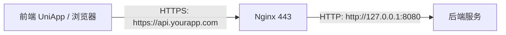

## 通信全程使用 HTTPS 那么需要保证有一个域名，并且nginx配置为443来转发后台接口吗

是的，你的理解**基本正确**，但需要更精确地说明 HTTPS 的部署架构。我们一步步拆解：

---

## ✅ 核心结论

> **要实现“通信全程使用 HTTPS”，你需要：**
>
> 1. **一个合法域名**（如 `api.yourapp.com`）
> 2. **有效的 TLS 证书**（如 Let's Encrypt 免费证书）
> 3. **一个 HTTPS 服务器**（如 Nginx 监听 443 端口）
> 4. **Nginx 将 HTTPS 请求反向代理到后端 HTTP 服务**

而你的后端（如 Node.js、Java、Go）**可以继续运行在 HTTP（如 8080）上**，由 Nginx 终止 TLS 并转发。

---

## 🌐 典型架构图



- **前端只和 Nginx 通信（HTTPS）**
- **Nginx 和后端通信（HTTP，内网）**
- **后端无需处理 TLS**

---

## 🔧 具体配置步骤

### 1️⃣ 准备域名

- 购买或使用已有域名（如 `yourapp.com`）

- 添加 DNS 记录：

  ```
  api.yourapp.com → 你的服务器公网 IP
  ```

### 2️⃣ 申请 TLS 证书（免费推荐 Let's Encrypt）

```bash
# 使用 certbot（以 Ubuntu 为例）
sudo apt install certbot
sudo certbot certonly --standalone -d api.yourapp.com
```

- 证书路径通常为：
  - 公钥（证书）：`/etc/letsencrypt/live/api.yourapp.com/fullchain.pem`
  - 私钥：`/etc/letsencrypt/live/api.yourapp.com/privkey.pem`

### 3️⃣ 配置 Nginx（监听 443，反向代理）

```nginx
server {
    listen 443 ssl;
    server_name api.yourapp.com;

    # TLS 证书
    ssl_certificate /etc/letsencrypt/live/api.yourapp.com/fullchain.pem;
    ssl_certificate_key /etc/letsencrypt/live/api.yourapp.com/privkey.pem;

    # 安全加固（可选但推荐）
    ssl_protocols TLSv1.2 TLSv1.3;
    ssl_ciphers ECDHE+AESGCM:DHE+AESGCM;

    location / {
        proxy_pass http://127.0.0.1:8080;  # 转发到后端
        proxy_set_header Host $host;
        proxy_set_header X-Real-IP $remote_addr;
        proxy_set_header X-Forwarded-For $proxy_add_x_forwarded_for;
        proxy_set_header X-Forwarded-Proto $scheme;  # 告诉后端原始是 HTTPS
    }
}

# 可选：HTTP 强制跳转 HTTPS
server {
    listen 80;
    server_name api.yourapp.com;
    return 301 https://$server_name$request_uri;
}
```

### 4️⃣ 后端服务（如 Node.js）保持 HTTP

```js
// app.js
const express = require('express');
const app = express();

app.post('/login', (req, res) => {
  // 通过 X-Forwarded-Proto 判断原始协议
  const isSecure = req.headers['x-forwarded-proto'] === 'https';
  // ... 处理逻辑
});

app.listen(8080, '127.0.0.1'); // 只监听内网
```

---

## ❓ 常见疑问解答

### Q1：**必须用 Nginx 吗？**

- ❌ 不是必须，但**强烈推荐**。
- 其他选择：
  - Caddy（自动 HTTPS）
  - Traefik（云原生）
  - 后端直接支持 HTTPS（如 Node.js `https.createServer`）
- ✅ **Nginx 优势**：性能高、可处理静态资源、负载均衡、WAF 集成

### Q2：**UniApp 打包 App 能用 IP + 自签名证书吗？**

- **H5 端**：浏览器会拦截自签名证书（必须有效证书 + 域名）
- **App 端（Android/iOS）**：
  - 理论上可信任自签名证书（需代码配置）
  - 但 **Google Play / App Store 可能拒绝**
  - **生产环境强烈建议用正式域名 + 有效证书**

### Q3：**本地开发怎么办？**

- 开发阶段可用：
  - `http://localhost:8080`（无 HTTPS）
  - 或用 `mkcert` 生成本地可信证书（用于 `https://localhost`）
- **但上线必须 HTTPS**

---

## 🛡️ 安全提醒

1. **不要把后端直接暴露在公网 HTTP 上**

   - 即使有防火墙，也应通过 Nginx 隔离

2. **证书自动续期**

   - Let's Encrypt 证书 90 天过期

   - 配置 cron 自动续期：

     ```bash
     0 3 * * * /usr/bin/certbot renew --quiet
     ```

3. **HSTS（可选增强）**

   - 在 Nginx 添加：

     ```nginx
     add_header Strict-Transport-Security "max-age=31536000" always;
     ```

   - 强制浏览器后续只用 HTTPS

---

## ✅ 总结：你的理解是对的

> ✅ **要用 HTTPS，就需要：**
>
> - **一个域名**
> - **Nginx（或类似）监听 443 端口**
> - **配置反向代理到后端 HTTP 服务**

这是**生产环境的标准做法**，安全、高效、易维护。

如果你正在部署 UniApp 后端，我可以提供：

- 完整的 Nginx 配置模板
- Let's Encrypt 自动续期脚本
- UniApp 请求 `https://api.yourapp.com` 的代码示例


## tsl层安全实现方案
go+vue
方案1：服务器环境，https方案测试，nginx代理转发 （demo测试）
方案2：同一个局域网，后台go签发证书，前端请求https需安装该安卓设备ca证书才能访问（demo测试）

